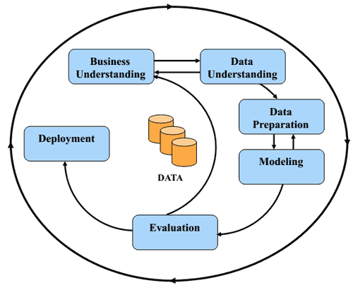

# CRISP-DM:  Rec The Trail
_A Washington Trails Association Hike Recommender_

**The Cross Industry Standard Process for Data Mining (CRISP-DM) describes guidelines for data scientists who develop data products.**  

The steps for CRISP-DM and their respective application to Rec The Trail are described below.

## Business Understanding
The business understanding component of CRISP-DM requires collaborating data scientists and business professionals to clearly outline the business problem that they are trying to address.  At this point, the metrics used, definitions of success and timelines should also be established.  While there is not an obvious business application of a hike recommendation website, the goal of this project was to 1) Minimize the time that people are spending searching for a hike on the WTA website and 2) provide them with hikes that will most accurately meet their hiking style.

## Data Understanding
Data understanding encompasses data collection and initial exploratory data analysis.  As no dataset of the WTA hikes is readily available, the data was scraped using requests and BeautifulSoup with Python.  Features of interest that were collected included, but were not limited to, hike length, elevation gain, number of reports (a proxy for hike popularity), overall rating, hike description and location.  

As the project went on, one road block that I ran into is that only the average number of stars is reported for each hike, not the star rating for each user and trip report author.  This detracts from the overall recommendation model as limits the depth of user-item interactions and does not allow models to recommend based on similar users.  Further, the issue of skew towards high ratings in five-star systems is well-documented [source, source, source].  It can also be observed in the overall hike ratings provided by the WTA.

[Graph of hikes w/ratings]

Therefore, I decided to make my own rating data, based on sentiment analysis of trip reports. This text data also had to be scraped. With experience and time comes wisdom, so this round, I used requests, BeautifulSoup and MongoDB to store my data neatly. I tried multiple methods of sentiment analysis on my trip reports, which is further discussed in data preparation and modeling.  

## Data Preparation
Ah the favorite task of any data scientist- Data preparation.  This component covers all data cleaning that is required in order for the data to be used in the model.  Data preparation tasks included:
  - Getting drive time estimates for each hike based on longitude and latitude data using the Google Maps API
  - Creating dummy variables for hike features such as 'Lakes/Rivers', 'Summits', 'Allows dogs on leash'
  - Applying sentiment analysis to trip report data to determine rating.  The following methods were used:
    * TextBlob polarity sentiment
    * Turi GraphLab built-in sentiment analysis model
    * Turi GraphLab sentiment analysis model trained on data scraped from everytrail.com
  - Mapping identification numbers to all hikes and trip report authors
  - Normalize hike item data for use in recommendation model
  - Building rating dataset and item data datasets for the GraphLab models

## Modeling
Modeling and evaluation was required at three different points in the project: determining which hike features to include in the model, modeling sentiment analysis and building a custom rating system, and building the actual recommender system.

##### Hike Feature Importance

#### Sentiment analysis

#### Building the Recommender System

## Evaluation

#### Hike Feature Importance

#### Sentiment analysis

#### Building the Recommender System

## Deployment
The deployment phase of a data science project is the form in which the knowledge gained from the previous steps is communicated or the form in which the data project is released.  In some cases, this may just take the form of a report.  For Rec The Trail, what good is a recommendation system if people can't use it? Therefore, I had to also flex my web development skills and developed a web application for people to use.

### [Rec The Trail](http://recthetrail.com/)

On Rec The Trail application, a new user can input a rating from a hike and receive recommendations based on similar hikes.  Additionally, a returning user can come back, add in a new recommendation and get recommendations using the ranking factorization recommender.  The website also has some baseline recommendations for people who don't want to input any ratings.

## Next steps
* Use more advanced techniques on the trip report text to improve sentiment analysis based rating system
* Refine the web application (add weather report, add gear recommendations such as microspikes if snow is present).
* Incorporate more filtering options for the use. (Ex. Limit drive time, less popular hike)

## Sources
