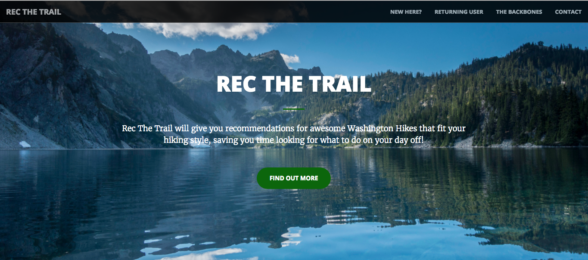
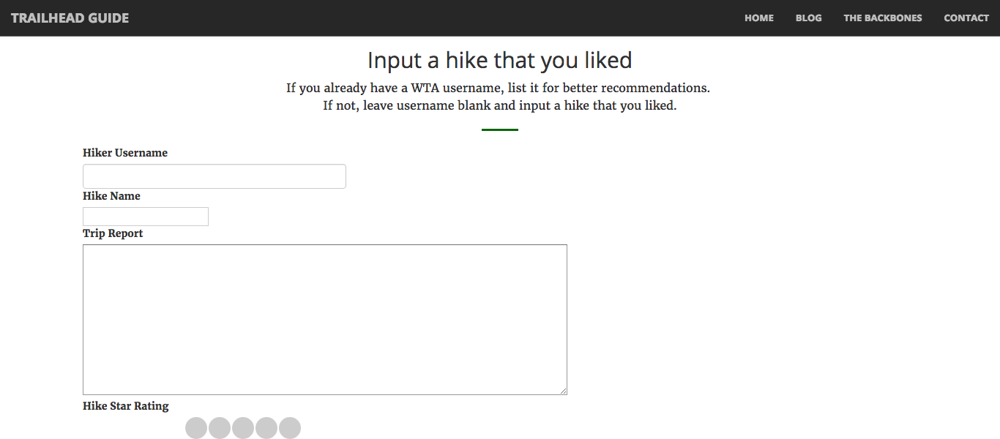

# Rec The Trail
A Washington Trails Association Hike Recommender

Galvanize Data Science Program - Summer 2016 - Capstone Project - Jade Tabony


## Overview

While the Washington Trails Association (WTA) provides a great resource for people to find hikes in their area that fit their specifications, the site does not have a recommender system to suggest hikes to people based on hikes that they have liked in the past.  I built [Rec The Trail](recthetrail.com) to fill exactly that gap.



## Web Application:  [recthetrail.com](http://recthetrail.com/)

At recthetrail.com, you can input a hike that you like along with either a rating or a trip report and it will give you five hike recommendations!

If you already have a WTA username, you can provide that for tailored refined hike recommendations.

[Recthetrail.com](http://recthetrail.com/) is created using Flask and self-hosted on AWS.



## Data Source

All of my data is scraped from the WTA website using requests and BeautifulSoup.  For each hike, I scraped the hike meta data, the trail description and all of the corresponding trip reports.  Since the website only provides an overall average rating, instead of individual user ratings, I used sentiment analysis on trip reports in order to create a rating system.

All of the data was stored in MongoDB.

## Stack

[Image]


For every hike, I scraped the provided longitude and latitude and used the Google API to calculate the drive time from Seattle.

From the hike description, I vectorized all of the text using TF-IDF.  I then performed k-means clustering to group hikes based on similar keywords.  Some of the groups produced were:
  * Loop hikes
  * Summits
  * Waterfalls
  * Rivers


#### Sentiment analysis

Due to the lack of individual ratings for each hike, I decided to apply sentiment analysis to each trip report to create a rating system.  I tried a variety of sentiment analysis methods....


#### Recommendation System

The recommendation system is implemented using Turi GraphLab (now owned by Apple).  I tried three different types of recommendation systems:
  * Factorization Recommender
  * Item Similatiry Recommender
  * **Ranking Factorization Recommender with Item Data**

The models were each evaluated using RMSE, Recall and Precision at N and A/B testing.  The final web app is built using ranking factorization with item data.


## Repo Structure

```
├── code
|   ├── ider_pickler.py (functions for pickling hike identification)
|   ├── recommender.py (builds final recommendation system and pickles it)
|   └── sentiment_analysis.py (functions for sentiment analysis and rating system)
|
├── EDA
|   ├── EDA.ipynb (hike feature exploration and visualization)
|   ├── Recommender.ipynb (recommender exploration and comparisons)
|   └── sentimentAnalysis.ipynb (Sentiment analysis model comparison)
|
├── scraper
|   ├── dataCleaning.py (parses scraped data, extracts meta data and uses Google API)
|   ├── trainingDataScraper.py (everytrail.com trip review scraper)
|   ├── tripReportScraper.py (wta.org trip report scraper)
|   └── wtaScraper.py (wta.org hike scraper)
|
├── web_app
|   ├── pickle (all pickled models used in the app)
|   ├── static
|   ├── templates
|   └── root.py (runs application)
|
├── CrispDM.md (write-up of Crisp-DM methodology used for this project)
├── Install.txt
└── README.md
```


## Future Work
  * Use more advanced techniques on the trip report text to improve sentiment analysis based rating system
  * Refine the web application (add weather report, add gear recommendations such as microspikes if snow is present).
  * Incorporate more filtering options for the use. (Ex. Limit drive time, less popular hike)
